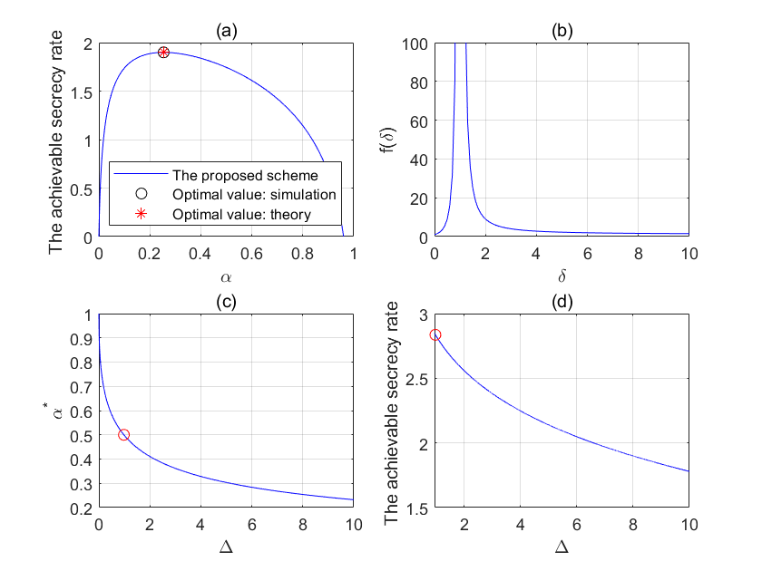
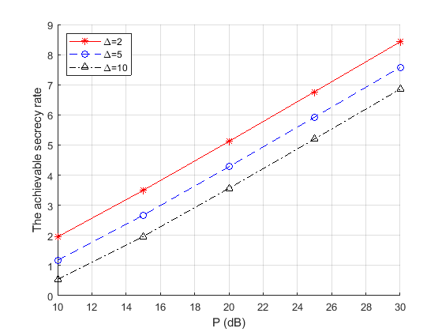

# Joint-Artificial-Noise-Repetition-Secure-Wireless-Comm-TDD
Matlab implementation for "Joint Artificial Noise and Repetition Coding for Secure Wireless Communications in TDD Systems" (https://ieeexplore.ieee.org/stamp/stamp.jsp?tp=&amp;arnumber=8815821)

## NUMERICAL RESULTS 
### Fig. 2. Relationship between different parameters.

### Fig. 3. Total power on the private information and the artificial noise versus the achievable secrecy rate.

